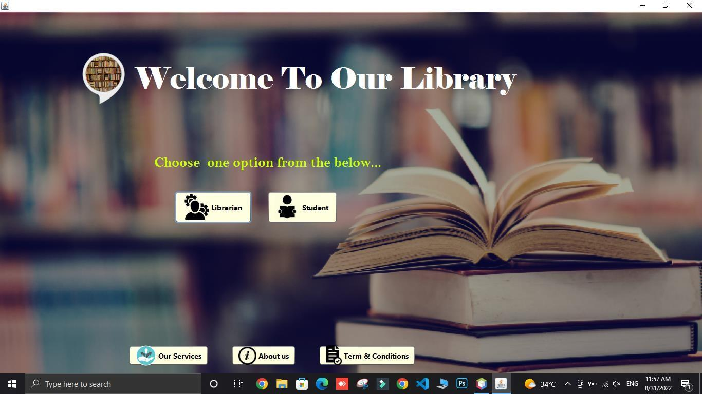
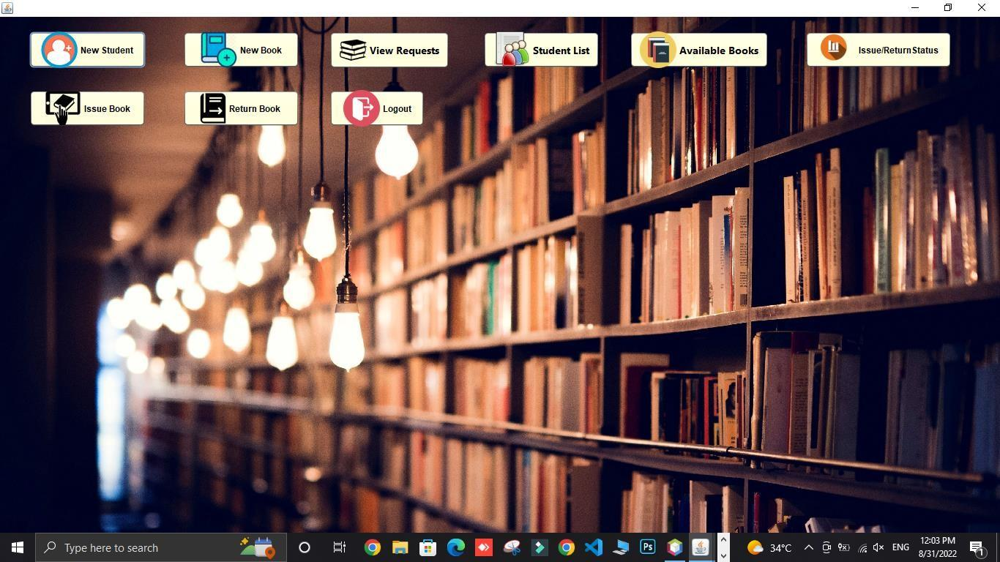
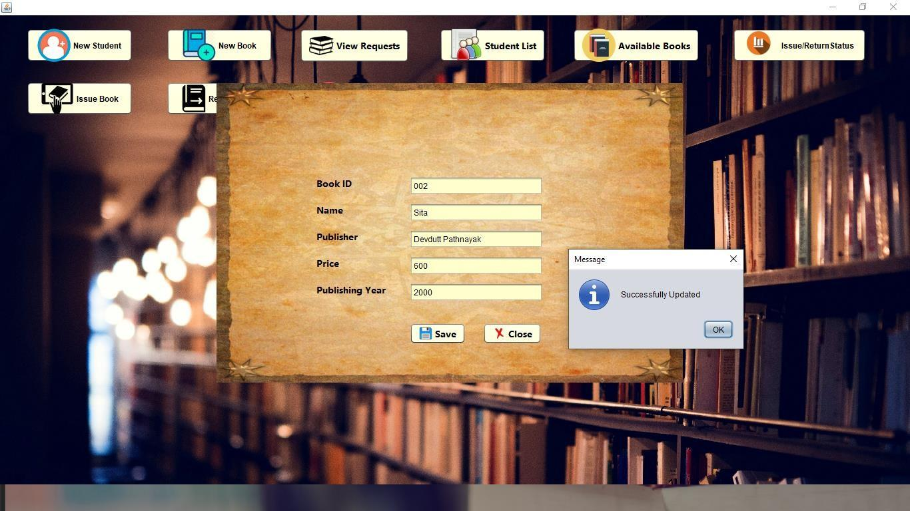
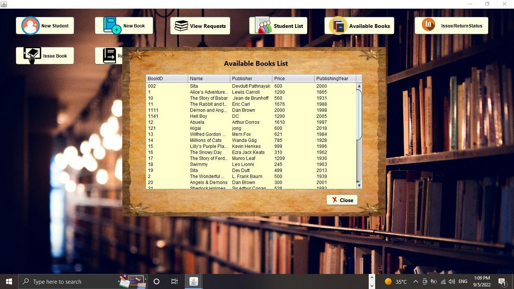
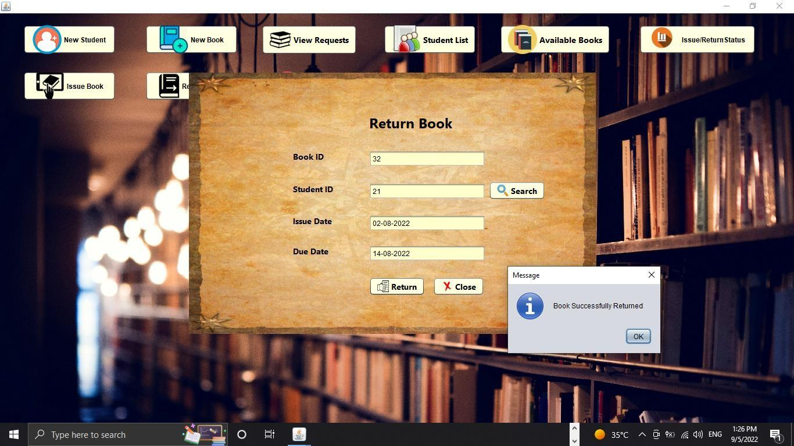
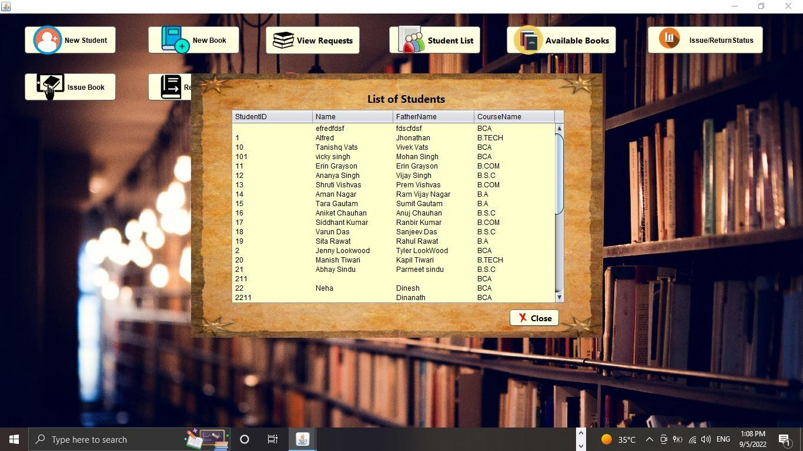
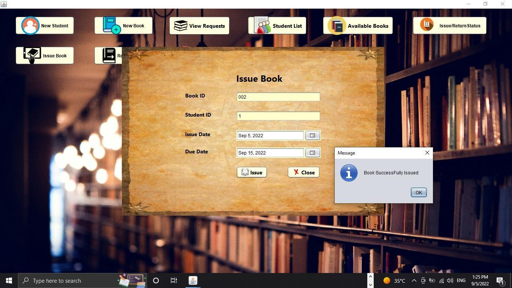
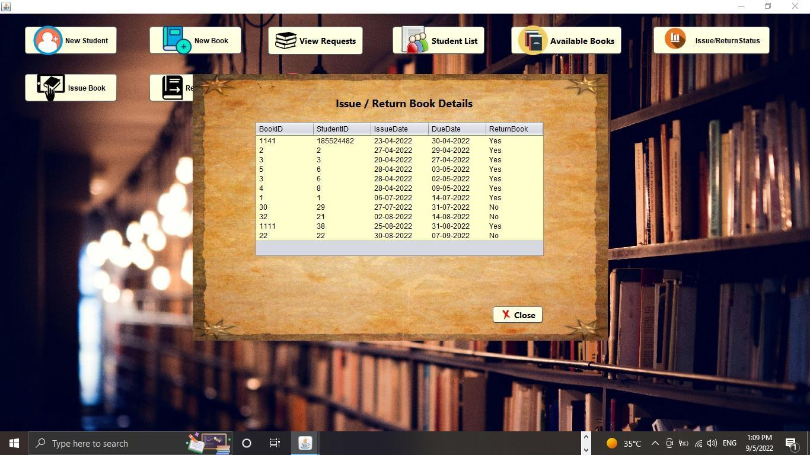
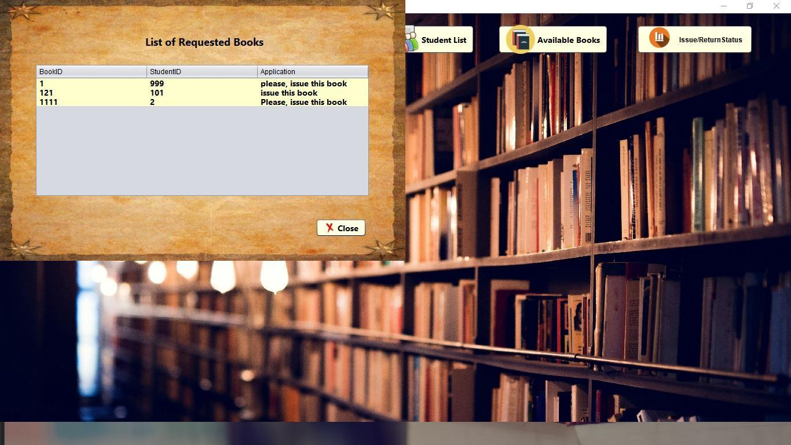
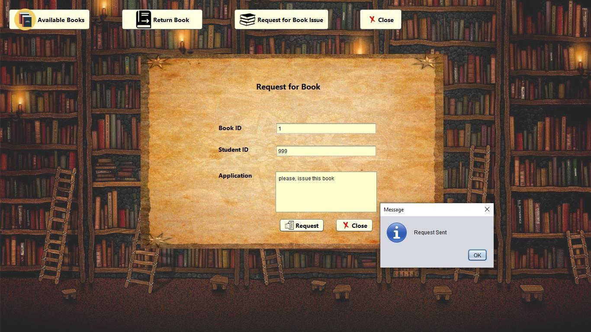

# 📚 Library Management System (LMS)


A **Library Management System (LMS)** developed to digitize and streamline 
book inventory, student borrowing records, and library operations.
This project was built as part of the **Diploma in Software Engineering**.

---

## 📌 About the Project

The Library Management System is designed to manage:

- Book inventory and categories
- Student borrowing and return records
- Issue and return cycle tracking
- Admin and student access control
- Transaction history and logs

It replaces manual register-based tracking with an efficient, 
accurate, and user-friendly desktop system.

---

## 🚀 Features

### 📖 Book Management
- Add, update, delete book records
- View books by category
- Track book availability

### 👩‍🎓 Student Management
- Register and manage student profiles
- View borrowing history
- Search student records

### 🔄 Issue & Return Management
- Issue books to students
- Record return dates
- Automated overdue tracking

### 🔐 User Management
- Role-based login (Admin / Student)
- Authentication and authorization

### 📊 Reports & Logs
- View transaction history
- Track all issue and return cycles
- Generate borrowing reports

---

## 👥 Actors / Users

- 👨‍💼 Admin
- 👩‍🎓 Student

---

## 🛠️ Tech Stack

**Language:**
- Java

**Database:**
- MySQL

**Connectivity:**
- JDBC (Java Database Connectivity)

**IDE:**
- NetBeans / IntelliJ IDEA

---

## 📊 Database Schema

- 6 Tables: Books, Students, Users, Categories, Transactions, Logs

---

## ⚙️ Installation & Setup

### Step 1: Install Requirements
- Install **JDK 8 or above**
- Install **MySQL**
- Install **NetBeans IDE** (recommended)

### Step 2: Setup Project
1. Clone the repository
2. Open project in NetBeans

### Step 3: Database Setup
1. Open **MySQL**
2. Create database:
   lms_db
3. Import:
   lms_db.sql

### Step 4: Configure Connection
1. Open `DBConnection.java`
2. Update MySQL username and password:
```java
String url = "jdbc:mysql://localhost:3306/lms_db";
String user = "your_username";
String password = "your_password";
```

### Step 5: Run Project
- Open in NetBeans
- Click **Run** or press **F6**

---

## 📸 Project Screenshots

### Admin
### 🔐 Login Page
<p align="center">
  
</p>

---

### 🏠 Dashboard
<p align="center">
  
</p>

---

### 📖 Book Management
<p align="center">
  
</p>

<p align="center">
  
</p>
---

### 👩‍🎓 Student Management
<p align="center">
  
</p>

<p align="center">
  
</p>
---

### 🔄 Issue & Return
<p align="center">
  
</p>

<p align="center">
  
</p>

<p align="center">
  
</p>

<p align="center">
  
</p>

---

### 👩‍🎓 Student
<p align="center">
  
</p>

### 🔄 Request for Issue Book
<p align="center">
  
</p>

---

## 👩‍💻 Developer
Neha Joshi
- 📧 Email: neha.joshi9299@gmail.com
- 💼 LinkedIn: linkedin.com/in/neha-joshi
